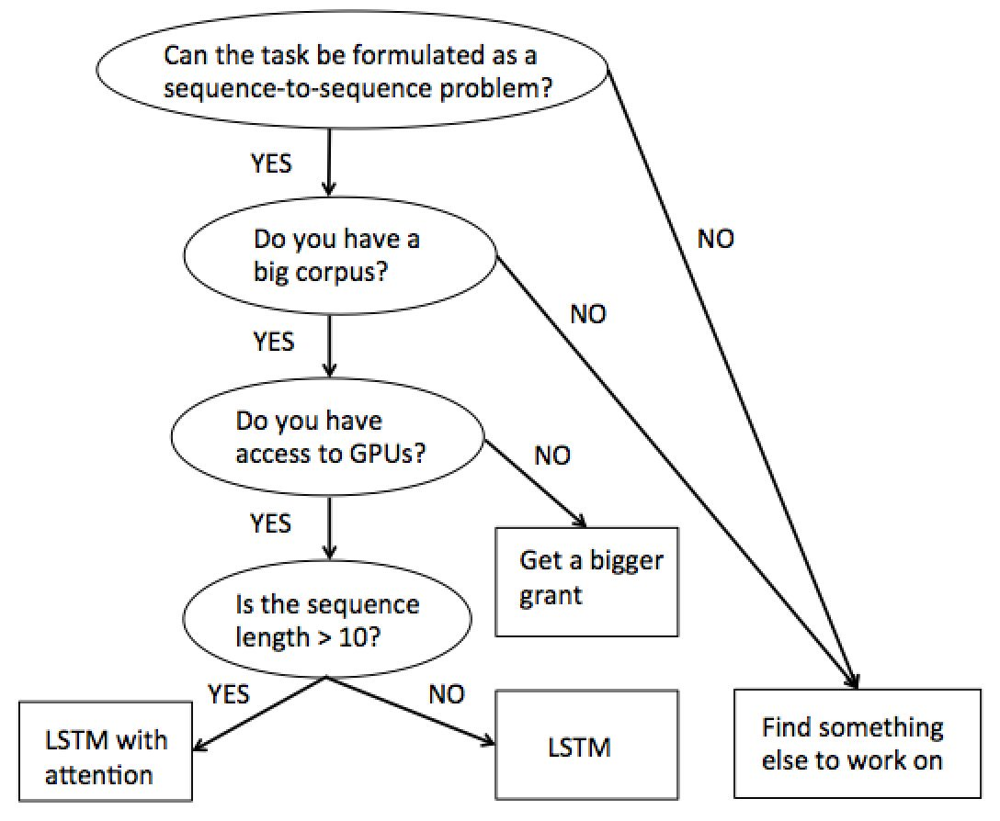

# 深度学习在自然语言处理中的关键技术

***

​	本文主体部分翻译自Sebastian Ruder的推文，该推文在很多地方都有推荐。

​	原文链接：http://ruder.io/deep-learning-nlp-best-practices/index.html#attention

​	这篇推文总结了深度学习在自然处理语言中任务的实践范例，我在翻译中对内容有删减增改。平时我学习工作中每天都会阅读新公布的论文，一段时间后，发现自己收获有限，萌生了做笔记的想法（我的十八年求学生涯中从没做过笔记: ) )。

​	翻译者 / 增补者：Hongjin

## 1. 前述

​	这篇推文总结了深度学习在自然处理语言中任务的实践范例。作者会定期更新本文，加入新涌现的实用技术和观点，也是我们对深度学习自然语言处理领域技术革新的追踪。

​	过去几年，在我们这个领域有个经久不衰的笑话：遇到任何任务，直接上LSTM加注意力机制，节能获得一流的效果。而且这样的境况在过去几年几乎一尘不变。

​	然而事情正在起变化，这一潭死水近来有了波澜，一些任务基准被新的模型刷新了。这也让我们这个行业一点点翻过LSTM这一页。面对这样的变化，我们应该以决绝的态度拥抱新模型，不要再拘于在LSTM的高楼上锦上添花，更不要挣扎于刷新某一个具体任务的成绩。

​	阅读这篇推文前，你被假定对神经网络在自然语言处理中的应用已经有一些了解了，并对相关任务有过实践。最重要的，是对自然语言处理这个行业有着极大的热情。

​	**Tips:** 不带缘由地假定什么是最好的有违公平性：依据是什么？是不是有更好的？所以，本文中提到的"最佳实践"一方面来自我个人的理解和经验，另一方面来自业界团队的评价。我也会尽可能为每个实践给出至少两个参考。

## 2. 最佳实践

### 1). 词向量 

​	于情于理，词向量都是近来最广为人知的实践范例了。词向量对绝大多数自然语言任务裨益良多(Kim, 2014)[^f1]。词向量的最优维度在取决于不同任务：低维度的词向量往往适用于句法分析任务，如实体识别和词性识别(Melamud et al., 2016) (Plank et al., 2016) [^fn2][^fn3]。而高维度词向量则更适用于语义分析任务，例如情感分析(Ruder et al., 2016)[^fn4]。

​	然而，近来随着语境化生成式词向量的兴起，句法分析任务的纪录榜单几乎都被高维度词向量模型占据了(Peters et al., 2018) (Devlin et al., 2018) (Akbik et al.,2018) (Baevski et al., 2019)[^fn5][^fn6][^fn7][^fn8]。

​	以下，译者会列举一些常用的词向量。

#### Word2Vec

#### Glove

#### Fasttext

#### BPEmb

#### ELMO

#### BERT

#### MASS

#### FLAIR 

### 2). 深度

​	尽管我们不会抵达视觉领域的层深，自然语言处理领域在深层网络上也略有进展。深度BiLSTM网络，通常由三四层那么深，在POS标注和语义角色标注任务上也取得了领先的成绩(Plank et al., 2016)  (He et al., 2017) [^fn9][^fn10]。对于特定的任务，模型会变得更深，比如谷歌的机器翻译模型就有八层encoder和decoder (Wu et al., 2016)[^fn11]。然而，对于大部分情况，两层以上的边际层深对效果的提升就会变的极其有限 (Reimers & Gurevych, 2017) [^fn12]。

​	以上结论对大部分序列标注和结构预测任务有效，在文本分类领域情况可能不同，一些深度网络配合字符级输入或者浅层词级输入仍能取得领先的成绩(Zhang et al., 2015; Conneau et al., 2016; Le et al., 2017) [][][^fn13][^fn14][^fn15]。

### 3). 层连

​	在训练深度神经网络时，采用一些技巧可以有效地避免梯度消失问题，比如不同的层和连接方式。这里，我们讨论以下三种：i). highway layers, ii). residual connection, iii). dense connection

#### Highway layers 

​	Highway layers 的出现是受到了LSTM中的门机制的启发 (Srivastava et al., 2015)[^fn20]。我们先考虑简单的一层感知器，它采用非线性函数$g$来对输入$x$进行了映射：
$$
\bf{h}=\mathcal{g}(\bf{Wx}+\bf{b})
$$
​	如果采用Highway layers，则用一下公式来计算：
$$
\bf{h}=\bf{t}\odot\mathcal{g}(\bf{Wx+\bf{b}})+(1-\bf{t})\odot\bf{x}
$$
​	$\odot$是元素级的乘。

​	其中，$\mathcal{g}(\bf{W_Tx+\bf{b_t}})$被称为transform门，$(1-\bf{t})$被称为carry门。从上式我们可以看出，类似LSTM的门机制，carry门适应性地让一些输入特征直接输出。

​	更多关于Highway layers的信息可以参考：

[Sristava的推文]: http://people.idsia.ch/~rupesh/very_deep_learning/

#### Residual connection

​	Residual connection一开始在视觉领域广为应用，它是一种比highway layers更直接的方式：
$$
\bf{h}=\mathcal{g}(\bf{Wx}+\bf{b})+\bf{x}
$$
​	它直接把当前层的输入特征加到输出特征上。这样的连接方式有效的解决了梯度消失问题，因为如果这一层梯度消失了，在这种连接方式下，这一层就类似被略过。

#### Dense connection

​	与residual connection仅仅与上一层的特征求和上不同，dense connection是把这一层之前所有层的输出都与本层输出连接(Huang et al., 2017) [^fn21]:
$$
\bf{h^\mathcal{l}}=\mathcal{g}(\bf{W[x^1;...;x^{\mathcal{l}}]+b})
$$
​	这里，$[\cdot ; \cdot]$代表concatenation。Dense connection在视觉领域取得了巨大成功。在自然语言处理领域中，这样的方式对多任务学习(Multi-Task Learning)有一定帮助 (Ruder et al., 2017)[^fn22]，在机器翻译领域，dense connection被发现比residual connection稍胜一筹(Britz et al., 2017)[^fn23]。

### 4). Dropout

### 5). 多任务学习(Multi-Task Learning)

​	如果有更多与任务相关的数据，在多任务学习的帮助下往往能获得更好的效果。关于多任务学习的更多信息，可以参考http://ruder.io/multi-task/index.html。

#### Auxiliary objectives (辅助目标)

​	在实际任务中，通常来说都是能找到一些辅助目标函数来提升任务效果的(Ruder, 2017)[^fn26]。比如，虽然我们在训练词向量的时候已经采用了用前后文来预测当前词的方法(Mikolov et al., 2013)，我们仍然可以用这个想法来在训练模型的时候做辅助目标函数[^fn27]。同样的方法在Seq2Seq任务中同样被使用[^fn28]。	

#### Task-specific layers (制定目标)

​	虽然常用的多任务学习方法是直接共享参数，但让模型从单独任务的网络层(task-specific layers)中学习参数同样有效。这可以通过在为特征任务在模型的底部再接一层输出层来实现(Søgaard & Goldberg, 2016)[^fn24]。另一种方式是同时引入私有的和共享的子空间 (Liu et al., 2017; Ruder et al., 2017)[^fn19][^fn25]。

### 6). 注意力

### 7). 优化器

​	如果说神经网络是黑盒，那么优化器就是黑盒中的玄学。有些时候，即使只是些微调参都能极大地改变模型的表现。例如，降低Adam中的$\beta_2$ 就可能造成很大改变(Dozat & Manning, 2017) [^fn16]。

#### 优化算法

​	Adam是这个领域中最受欢迎和广为使用的优化算法，也是众多研究者的第一选择。Adam和SGD有很长的相爱相杀的历史。起初，初版SGD是在这个行业有着崇高的地位，而后来Adam的出现极大地遮蔽了初版SGD的荣光。一段时间后，当人们沉浸在Adam的多快好省的快乐中时，一些研究者提出，姜还是老的辣：配合衰减的学习率，SGD能比Adam强那么一丢丢  (Wu et al., 2016) [^fn17]。近来，又有学者表示，SGD带上适当的动量，同样能强过Adam (Zhang et al., 2017)[^fn18]。

#### 优化策略

​	尽管Adam自身就对每一个参数的学习率有调整(Ruder, 2016) [^fn19]，我们同样可以引入SGD风格的衰减策略。尤其是我们可以在重启训练的时候衰减学习率：先设定一个学习率训练模型直到收敛，然后把学习率减半，加载最好的预训练模型再训练一次。对于Adam，这样做的好处是能够把之前对参数学习率的调整忘却，重头做器。 Denkowski & Neubig (2017) 的结论显示两次重启训练的Adam配合学习率衰减，比SGD配合学习率衰减更多快好省。

#### 优化器算法初窥

以下，译者会列举一下常用的优化器及其衍生品，并对原理做简单的说明。

##### SGD

##### Adam

### 8). 集成

### 9). 调参

### 10). LSTM的技巧

## 3. 任务最佳实践

### 1). 分类

### 2). 序列标注

### 3). 自然语言生成

### 4). 神经网络机器翻译

## 4. 论文笔记

## 5. 尾述

[^fn1]: Kim, Y. (2014). Convolutional Neural Networks for Sentence Classification. Proceedings of the Conference on Empirical Methods in Natural Language Processing, 1746–1751. Retrieved from [http://arxiv.org/abs/1408.5882](http://arxiv.org/abs/1408.5882)
[^fn2]: Melamud, O., McClosky, D., Patwardhan, S., & Bansal, M. (2016). The Role of Context Types and Dimensionality in Learning Word Embeddings. In Proceedings of NAACL-HLT 2016 (pp. 1030–1040). Retrieved from [http://arxiv.org/abs/1601.00893](http://arxiv.org/abs/1601.00893)
[^fn3]: Plank, B., Søgaard, A., & Goldberg, Y. (2016). Multilingual Part-of-Speech Tagging with Bidirectional Long Short-Term Memory Models and Auxiliary Loss. In Proceedings of the 54th Annual Meeting of the Association for Computational Linguistics.
[^fn4]: Ruder, S., Ghaffari, P., & Breslin, J. G. (2016). A Hierarchical Model of Reviews for Aspect-based Sentiment Analysis. Proceedings of the 2016 Conference on Empirical Methods in Natural Language Processing (EMNLP-16), 999–1005. Retrieved from [http://arxiv.org/abs/1609.02745](http://arxiv.org/abs/1609.02745)
[^fn5]: Peters, M. E., Neumann, M., Iyyer, M., Gardner, M., Clark, C., Lee, K., & Zettlemoyer, L. (2018). Deep contextualized word representations. *arXiv preprint arXiv:1802.05365*.
[^fn7]: Devlin, J., Chang, M. W., Lee, K., & Toutanova, K. (2018). Bert: Pre-training of deep bidirectional transformers for language understanding. *arXiv preprint arXiv:1810.04805*.
[^fn6]: Akbik, A., Blythe, D., & Vollgraf, R. (2018, August). Contextual string embeddings for sequence labeling. In *Proceedings of the 27th International Conference on Computational Linguistics* (pp. 1638-1649).
[^fn8]: Baevski, A., Edunov, S., Liu, Y., Zettlemoyer, L., & Auli, M. (2019). Cloze-driven Pretraining of Self-attention Networks. *arXiv preprint arXiv:1903.07785*.
[^fn9]: Plank, B., Søgaard, A., & Goldberg, Y. (2016). Multilingual part-of-speech tagging with bidirectional long short-term memory models and auxiliary loss. *arXiv preprint arXiv:1604.05529*.
[^fn10]: He, L., Lee, K., Lewis, M., & Zettlemoyer, L. (2017). Deep Semantic Role Labeling: What Works and What’s Next. ACL.
[^fn11]: Wu, Y., Schuster, M., Chen, Z., Le, Q. V, Norouzi, M., Macherey, W., … Dean, J. (2016). Google’s Neural Machine Translation System: Bridging the Gap between Human and Machine Translation. arXiv Preprint arXiv:1609.08144.
[^fn12]: Reimers, N., & Gurevych, I. (2017). Optimal Hyperparameters for Deep LSTM-Networks for Sequence Labeling Tasks. In arXiv preprint arXiv:1707.06799: Retrieved from https://arxiv.org/pdf/1707.06799.pdf
[^fn13]: Zhang, X., Zhao, J., & LeCun, Y. (2015). Character-level Convolutional Networks for Text Classification. Advances in Neural Information Processing Systems, 649–657. Retrieved from [http://arxiv.org/abs/1509.01626](http://arxiv.org/abs/1509.01626)
[^fn14]: Conneau, A., Schwenk, H., Barrault, L., & Lecun, Y. (2016). Very Deep Convolutional Networks for Natural Language Processing. arXiv Preprint arXiv:1606.01781. Retrieved from [http://arxiv.org/abs/1606.01781](http://arxiv.org/abs/1606.01781)
[^fn15]: Le, H. T., Cerisara, C., & Denis, A. (2017). Do Convolutional Networks need to be Deep for Text Classification ? In arXiv preprint arXiv:1707.04108.
[^fn16]: Dozat, T., & Manning, C. D. (2017). Deep Biaffine Attention for Neural Dependency Parsing. In ICLR 2017. Retrieved from [http://arxiv.org/abs/1611.01734](http://arxiv.org/abs/1611.01734)
[^fn17]: Kingma, D. P., & Ba, J. L. (2015). Adam: a Method for Stochastic Optimization. International Conference on Learning Representations.
[^fn18]: Zhang, J., Mitliagkas, I., & Ré, C. (2017). YellowFin and the Art of Momentum Tuning. arXiv preprint arXiv:1706.03471.
[^fn19]: Ruder, S. (2016). An overview of gradient descent optimization. arXiv Preprint arXiv:1609.04747.
[^fn21]: He, K., Zhang, X., Ren, S., & Sun, J. (2016). Deep Residual Learning for Image Recognition. In CVPR.
[^fn20]: Huang, G., Weinberger, K. Q., & Maaten, L. Van Der. (2016). Densely Connected Convolutional Networks. CVPR 2017.
[^fn22]: Ruder, S., Bingel, J., Augenstein, I., & Søgaard, A. (2017). Sluice networks: Learning what to share between loosely related tasks. arXiv Preprint arXiv:1705.08142. Retrieved from [http://arxiv.org/abs/1705.08142](http://arxiv.org/abs/1705.08142)
[^fn23]: Britz, D., Goldie, A., Luong, T., & Le, Q. (2017). Massive Exploration of Neural Machine Translation Architectures. In arXiv preprint arXiv:1703.03906.
[^fn24]: Søgaard, A., & Goldberg, Y. (2016). Deep multi-task learning with low level tasks supervised at lower layers. Proceedings of the 54th Annual Meeting of the Association for Computational Linguistics, 231–235.
[^fn25]: Liu, P., Qiu, X., & Huang, X. (2017). Adversarial Multi-task Learning for Text Classification. In ACL 2017. Retrieved from [http://arxiv.org/abs/1704.05742](http://arxiv.org/abs/1704.05742) [↩︎](http://ruder.io/deep-learning-nlp-best-practices/index.html#fnref30)
[^fn26]: Ruder, S. (2017). An Overview of Multi-Task Learning in Deep Neural Networks. In arXiv preprint arXiv:1706.05098.
[^fn27]: Rei, M. (2017). Semi-supervised Multitask Learning for Sequence Labeling. In Proceedings of ACL 2017.
[^fn28]: Ramachandran, P., Liu, P. J., & Le, Q. V. (2016). Unsupervised Pretrainig for Sequence to Sequence Learning. arXiv Preprint arXiv:1611.02683.